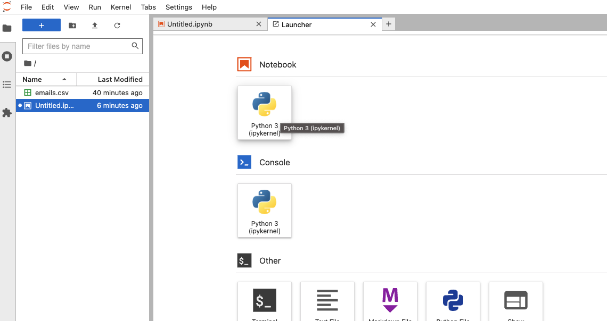
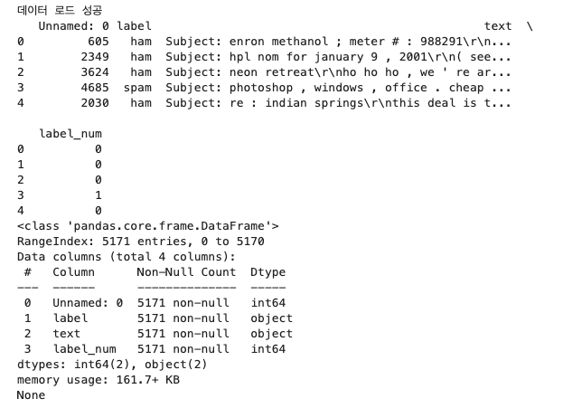
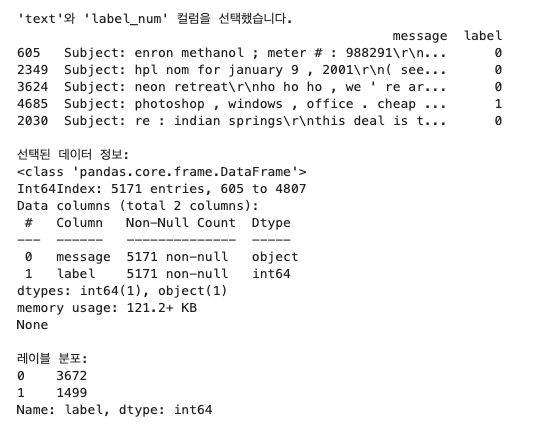
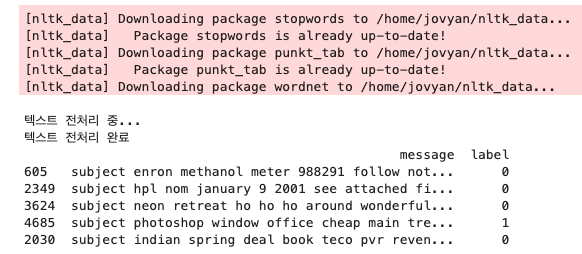
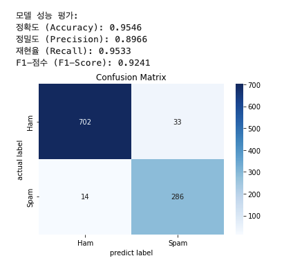
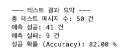

+++
date = '2025-05-09T18:40:25+09:00'
draft = false
title = 'AI 머신러닝 모델 구축(초급)'
+++
# 머신러닝 모델 구축

## 목차
- 머신러닝 모델에 대한 간략한 설명
- 이메일 데이터셋 로딩 및 라벨 처리
- 텍스트 정제 (소문자 변환, 특수문자 제거, 불용어 제거, 표제어 추출)
- TF-IDF 기반 벡터화
- 나이브 베이즈 분류 모델 학습 및 성능 평가 (정확도, 정밀도 등)
- 새로운 이메일 메시지에 대한 스팸 여부 예측

## 의의
머신러닝 모델 구축은 `데이터 준비`, `전처리`, `특성 추출`, `모델 선택 및 학습`, `평가` 등 여러 단계를 거침.<br/>

## 머신 러닝 접근 방식
1. 해결하고자 하는 문제의 성격
2. 가지고 있는 데이터의 형태

<b>모델 판단 기준</b>
- 데이터와 정답이 포함된 데이터 : 지도학습<br/>
    - 주요 문제 수행 유형 <br/>
        예시) 스팸 메일 분류, 주택 가격 예측,,,
- 데이터만 포함된 데이터 : 비지도 학습
    - 주요 문제 수행 유형 <br/>
        예시) 데이터들을 유사한 특성을 가진 그룹으로 묶는 문제, 노이즈 제거, 정상 범주에서 벗어나는 데이터를 찾아내는 문제
- .....etc

## 시나리오
막연하게 단계별로 어떤 목적을 가지고 수행한다. 이건 받아들여지기에 좀 무리가 있을수 있다고 보임.
> 사내의 OO프로젝트에서 내가 스팸 메일 분류 기능을 맡게 되었다

라고 생각하며 이야기를 풀어가 보겠음.

## 데이터 준비
> 내부 구성원이 친절하게 스팸 여부와 메일 내용을 분류해준 데이터 셋을 제공 받았다고 가정.

[from_kaggle](https://www.kaggle.com/datasets/venky73/spam-mails-dataset)


## Requirements.
- docker
```bash
docker --version
Docker version 24.0.7, build afdd53b
```
### 1. 프로젝트의 도커 파일을 이미지 빌드
```bash
docker buildx build -t python-jupyter . # macos
```
```bash
docker build -t python-jupyter . # others...
```
### 2. 빌드한 이미지로 컨테이너 실행
```bash
docker run -p 8888:8888 -v $(pwd)/volumes:/app --name python-jupyter python-jupyter
```

### 3. 주피터 접속<br/>
[http://localhost:8888](http://localhost:8888)

### 4. 프로젝트 생성

> Notebook - Python 3 클릭

PS. `./full_source_code.py`에 전체 소스코드 있으니 그거 사용해도 됨.


## 1. 데이터 수집 및 탐색
- package 설치(<b><i>Optional</i></b>)
```python
!pip install pandas numpy scikit-learn nltk matplotlib seaborn
```
- 데이터 불러오기 및 확인
```python
import pandas as pd
import numpy as np
import re
import nltk
from nltk.corpus import stopwords
from nltk.tokenize import word_tokenize
from nltk.stem import WordNetLemmatizer
nltk.download('stopwords')
nltk.download('punkt_tab')
nltk.download('wordnet')

from sklearn.model_selection import train_test_split
from sklearn.feature_extraction.text import TfidfVectorizer # 텍스트 벡터화에 사용
from sklearn.naive_bayes import MultinomialNB
from sklearn.metrics import accuracy_score, precision_score, recall_score, f1_score, confusion_matrix

import matplotlib.pyplot as plt
import seaborn as sns

file_path = 'emails.csv'

try:
    df = pd.read_csv(file_path, encoding='UTF-8', index_col=0)
    print(df.head()) # 데이터 상위 ## 5행 확인
    print(df.info()) # 데이터프레임 정보 확인
    print(f"\n데이터셋 형태: {df.shape}")

except FileNotFoundError:
    print(f"오류: 파일을 찾을 수 없습니다. 경로를 확인해주세요: {file_path}")
except Exception as e:
    print(f"데이터 로드 또는 처리 중 오류 발생: {e}")
```
- 데이터 불러오기 및 확인: 결과 <br/>


```python
# 필요한 컬럼 확인 및 선택
if 'text' in df.columns and ('label' in df.columns or 'label_num' in df.columns):
    if 'label_num' in df.columns:
        df_selected = df[['text', 'label_num']].copy()
        # message: 질의문, label: 정답지
        df_selected.columns = ['message', 'label']
        print("\n'text'와 'label_num' 컬럼을 선택했습니다.")

    print(df_selected.head())
    print("\n선택된 데이터 정보:")
    print(df_selected.info())
    print("\n레이블 분포:")
    print(df_selected['label'].value_counts())
```
- 데이터 로드 이후 필요한 데이터만 선택: 결과 <br/>


## 2. 데이터 전처리
```python
if not df_selected.empty:
    # 텍스트 전처리 함수 정의
    stop_words = set(stopwords.words('english'))
    lemmatizer = WordNetLemmatizer()

    # 문자열에 대해 필요한것만 남기고 파싱하는 함수.
    def preprocess_text(text):
        # NaN 값 처리
        if pd.isna(text):
            return ""
        # 소문자 변환 및 불필요한 문자 제거
        text = str(text).lower() # 문자열 타입으로 변환
        text = re.sub(r'[^a-z0-9\s]', '', text) # 알파벳 소문자, 숫자, 공백만 남김

        # 토큰화
        tokens = word_tokenize(text)

        # 불용어 제거 및 표제어 추출
        processed_tokens = [
            lemmatizer.lemmatize(word) for word in tokens if word not in stop_words
        ]

        return ' '.join(processed_tokens)

    print("\n텍스트 전처리 중...")
    df_selected['message'] = df_selected['message'].apply(preprocess_text)
    print("텍스트 전처리 완료")
    print(df_selected.head()) # 전처리된 데이터 확인
```
- 데이터 전처리: 결과 <br/>
nltk_data 설치과정은 생략될수 있음

```python
# 텍스트 데이터를 숫자로 바꾸는 과정, 즉 특성 추출에 해당
if not df_selected.empty:
    # TF-IDF Vectorizer 초기화 및 학습, max_features: 상위 n개의 특성 사용
    tfidf_vectorizer = TfidfVectorizer(max_features=5000)

    # 메시지 데이터를 벡터로 변환
    X = tfidf_vectorizer.fit_transform(df_selected['message']).toarray() # 질의문
    y = df_selected['label'] # 정답지

    print(f"\nTF-IDF 변환 후 특성 매트릭스 형태: {X.shape}")
```
- 특성 추출: 결과 <br/>
```txt
TF-IDF 변환 후 특성 매트릭스 형태: (5171, 5000)
```
## 3. 모델 선택 및 학습
> 메시지를 숫자로 변환된 것의 빈도를 파악<br/> 즉, 해당 메세지의 전체적인 맥락을 파악하겠다<br/> 이때 맥락 파악을 하기 위해서 `다항 나이브 베이즈 모델`(단어의 빈도 기반 특성을 잘 활용하며, 텍스트 분류 작업에 널리 사용)을 사용.<br/>
```python
# 데이터 분할
# X와 y가 정의되었는지 확인
if 'X' in locals() and 'y' in locals():
    # 학습 세트와 테스트 세트로 분할
    X_train, X_test, y_train, y_test = train_test_split(X, y, test_size=0.2, random_state=42, stratify=y)

    print(f"\n학습 세트 크기: {X_train.shape}")
    print(f"테스트 세트 크기: {X_test.shape}")
# 학습 데이터가 준비되었는지 확인
if 'X_train' in locals() and 'y_train' in locals():
    # 다항 나이브 베이즈 모델 초기화
    my_trained_model = MultinomialNB()

    # 모델 학습
    print("\n모델 학습 중...")
    my_trained_model.fit(X_train, y_train)
    print("모델 학습 완료")
```

## 4. 모델 평가
# NOTE 여기 아래 설명 좀더 추가할것.... 오차 행렬 시각화
```python
# 모델과 테스트 데이터가 준비되었는지 확인
# X_test: 테스트 데이터의 특성(벡터화 결과)
# y_test: 실제 레이블 (정답지)
if 'my_trained_model' in locals() and 'X_test' in locals() and 'y_test' in locals():
    # 테스트 세트로 예측
    y_pred = my_trained_model.predict(X_test)

    # 모델 성능 평가
    accuracy = accuracy_score(y_test, y_pred)
    precision = precision_score(y_test, y_pred)
    recall = recall_score(y_test, y_pred)
    f1 = f1_score(y_test, y_pred)

    print(f"\n모델 성능 평가:")
    print(f"정확도 (Accuracy): {accuracy:.4f}")
    print(f"정밀도 (Precision): {precision:.4f}")
    print(f"재현율 (Recall): {recall:.4f}")
    print(f"F1-점수 (F1-Score): {f1:.4f}")

    # 오차 행렬 시각화
    cm = confusion_matrix(y_test, y_pred)
    plt.figure(figsize=(6, 4))
    sns.heatmap(cm, annot=True, fmt='d', cmap='Blues', xticklabels=['Ham', 'Spam'], yticklabels=['Ham', 'Spam'])
    plt.xlabel('predict label')
    plt.ylabel('actual label')
    plt.title('Confusion Matrix')
    plt.show()
```
- 모델 평가: 결과 <br/>

<br/>

## 5. 실제 테스트로 정답/오답률 확인
```python
# 모델과 TF-IDF 객체가 준비되었는지 확인
if 'my_trained_model' in locals() and 'tfidf_vectorizer' in locals() :
    # 테스트에 사용할 예시 메시지 리스트
    # 실제 한국어 스팸 내용을 영문으로 의역하거나 유형을 반영한 예시를 추가했습니다.
    # 메시지와 레이블 길이 확인
    new_messages = [
        "URGENT! You have won a free iPhone. Click here to claim!", # 스팸 (1)
        "Meeting scheduled for 3 PM tomorrow in conference room B.", # 정상 (0)
        "Limited time offer! Get big discounts on male enhancement pills.", # 스팸 (1)
        "Please find the attached report for Q3 performance review.", # 정상 (0)
        "Exclusive investment opportunity! Guaranteed high returns.", # 스팸 (1)
        "Your package delivery requires immediate action. Update your address now.", # 스팸 (1)
        "Hello team, regarding the project deadline extension request.", # 정상 (0)
        "We detected suspicious activity on your account. Verify your details immediately.", # 스팸 (1)
        "Newsletter from our company. Important updates inside.", # 정상 (0)
        "Get huge savings! Up to 70% off on selected items. Shop now!", # 스팸 (1)
        "Just confirming our coffee chat tomorrow morning.", # 정상 (0)
        "You are selected! Claim your lottery prize of $1,000,000.", # 스팸 (1)
        "★Urgent★ Last Chance for Government-Supported Loans! Apply Now!", # 스팸 (1)
        "70% Discount on Adult Products! Special Price Today Only!", # 스팸 (1)
        "Free Trial! Get One Month's Supply of Diet Supplements", # 스팸 (1)
        "Request to Unblock Spam. This is a Normal Email.", # 정상 (0)
        "Congratulations on Your Win! 1 Million Won Gift Certificate Issued", # 스팸 (1)
        "We will notify you of Tax Refund Recipients. Check Now.", # 스팸 (1)
        "Your Password Has Expired. Click Here to Reset It.", # 스팸 (1)
        "Invoice attached for recent purchase. Please review.", # 정상 (0)
        "New feature update available for download.", # 정상 (0)
        "Claim your inheritance from a foreign relative now!", # 스팸 (1)
        "Your order has been shipped. Track your package here.", # 정상 (0)
        "Congratulations! You have been chosen for a special offer.", # 스팸 (1)
        "Meeting minutes from yesterday's discussion.", # 정상 (0)
        "Important notice from the tax office.", # 스팸 (1)
        "Project proposal draft for your review.", # 정상 (0)
        "Low price alert! Stock up on medical supplies.", # 스팸 (1)
        "System maintenance scheduled for tonight.", # 정상 (0)
        "Exclusive discount for our loyal customers.", # 스팸 (1)
        "Summary of weekly progress report.", # 정상 (0)
        "High-yield investment opportunity. Limited slots!", # 스팸 (1)
        "Feedback request regarding our recent service.", # 정상 (0)
        "Urgent action required: Confirm your identity.", # 스팸 (1)
        "Question about your recent inquiry.", # 정상 (0)
        "Important health information you need to know.", # 스팸 (1)
        "Welcome to our community! Get started here.", # 정상 (0)
        "Your free trial has ended. Subscribe now!", # 스팸 (1)
        "Meeting agenda for the upcoming week.", # 정상 (0)
        "Act now! Limited supply of popular products.", # 스팸 (1)
        "Report on market trends for this quarter.", # 정상 (0)
        "Get rich quick scheme - guaranteed results!", # 스팸 (1)
        "Updates regarding your recent application.", # 정상 (0)
        "Important information about your health insurance.", # 스팸 (1)
        "Confirmation of your appointment.", # 정상 (0)
        "Win a free gift card!", # 스팸 (1)
        "Regarding the meeting time change.", # 정상 (0)
        "Lose weight fast with this amazing pill!", # 스팸 (1)
        "Please review and approve the attached document.", # 정상 (0)
        "Urgent security patch needed." # 스팸 (1)
    ]


    # 각 메시지에 대한 예상 레이블 (0: 정상/Ham, 1: 스팸/Spam)
    # new_messages 리스트의 순서와 정확히 일치하도록 수정했습니다.
    expected_labels = [
        1, 0, 1, 0, 1, 1, 0, 1, 0, 1,
        0, 1, 1, 1, 1, 0, 1, 1, 1, 0,
        0, 1, 0, 1, 0, 1, 0, 1, 0, 1,
        0, 1, 0, 1, 0, 1, 0, 1, 0, 1,
        0, 1, 0, 1, 0, 1, 0, 1, 0, 1
    ]


    # 메시지 수와 레이블 수가 일치하는지 확인
    if len(new_messages) != len(expected_labels):
        raise ValueError("오류: 메시지 수와 레이블 수가 다릅니다.")

    # 메시지 전처리 및 벡터화
    processed = [preprocess_text(msg) for msg in new_messages]
    X_new = tfidf_vectorizer.transform(processed).toarray()

    # 예측 수행
    predictions = my_trained_model.predict(X_new)

    # 결과 분석 및 출력
    correct = 0
    for i, (msg, pred, actual) in enumerate(zip(new_messages, predictions, expected_labels)):
        match = pred == actual
        result = "✅" if match else "❌"

        if not match:
            print(f"[{result}]")
            print(f"메시지       : '{msg}'")
            print(f"예상 레이블 : {'스팸' if actual else '정상'} ({actual})")
            print(f"모델 예측   : {'스팸' if pred else '정상'} ({pred})")
            print("-" * 40)
        else:
            correct += 1

    # 최종 요약 출력
    total = len(new_messages)
    print("\n 테스트 결과 요약")
    print(f"총 테스트 수    : {total}건")
    print(f"정확히 예측한 수 : {correct}건")
    print(f"예측 실패 수     : {total - correct}건")
    print(f"정확도           : {correct / total * 100:.2f}%")
```
- 실제 테스트로 정답/오답률 확인: 결과 <br/>
